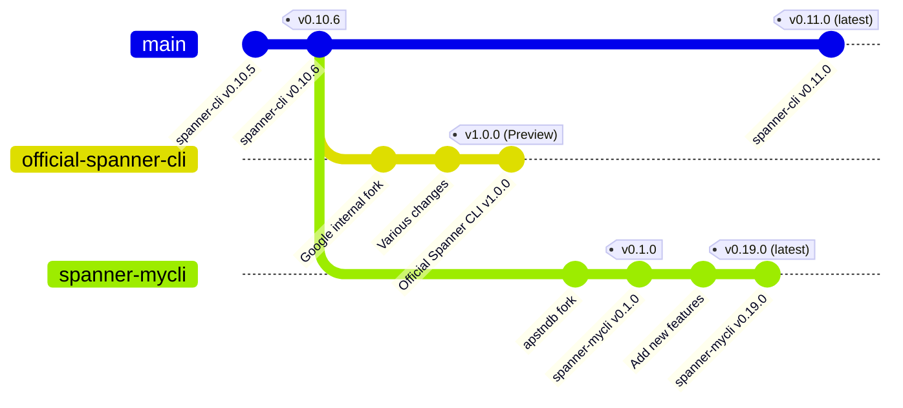

公式の Spanner CLI がプレビューリリースされました。
https://cloud.google.com/spanner/docs/release-notes
> You can directly connect and interact with your Spanner database using the Spanner CLI, an interactive shell for Spanner that is built into the Google Cloud CLI. You can use the Spanner CLI to start an interactive session and automate SQL executions from the shell or an input file. This feature is available in [Preview](https://cloud.google.com/products#product-launch-stages). For more information, see [Spanner CLI quickstart](https://cloud.google.com/spanner/docs/spanner-cli).

これが何なのかについて観察して分かることについて、 OSS である [spanner-cli](https://github.com/cloudspannerecosystem/spanner-cli) のコントリビュータであり、そのフォークである [spanner-mycli](https://github.com/apstndb/spanner-mycli) の作者である無職の技術愛好家 apstndb の視点で書いていこうと思います。  spanner-mycli については [私が spanner-cli をフォークした理由: spanner-mycli の紹介](https://zenn.dev/apstndb/articles/introduce-spanner-mycli) なども読んでみてください。

:::message
この記事はまだ Preview である `gcloud alpha spanner cli` について、2025年6月28日時点の状態で見えるものについて説明しています。いつ仕様が変わるか分からないことに注意してください。
:::

## この記事のポイント

- 公式 Spanner CLI は OSS spanner-cli v0.10.6 からの派生
- バイナリ解析により技術的な証拠を発見
- メタコマンドの導入など独自の進化
- 公式とOSSの共存による健全なエコシステムへの期待

## 対話型ツールの重要性

SQL データベースにおいて対話型クライアントというのは必須のものであり続けました。

SQL データベースにおいて対話型クライアントは、SQLの前身である [SEQUEL: A structured English query language](https://dl.acm.org/doi/10.1145/800296.811515) の時代から interactive system として言及されているように必須のツールとして認識されてきました。
主要なRDBMSは例外なくファーストパーティーの対話型クライアントを提供しています：

- MySQL の [mysql](https://dev.mysql.com/doc/refman/9.3/en/mysql.html)
- PostgreSQL の [psql](https://www.postgresql.org/docs/current/app-psql.html)
- Oracle の [dbcli](https://docs.oracle.com/en/cloud/paas/base-database/cli-reference/index.html)
- SQL Server の [mssql-cli](https://github.com/dbcli/mssql-cli), [sqlcmd](https://github.com/microsoft/go-sqlcmd)
  - SQL Server は他と比べると GUI ツールの [SQL Server Management Studio](https://learn.microsoft.com/en-us/ssms/) の比重が大きそうです。
  - 
対して Spanner はどうだったでしょうか。ユーザが直接使うことができる公式が提供するインターフェースは次のようなものでした。

- [gcloud CLI 内の `gcloud spanner` サブコマンド](https://cloud.google.com/spanner/docs/getting-started/gcloud)
- Google Cloud 公式の Web UI である Cloud Console 内の [Spanner Studio](https://cloud.google.com/spanner/docs/manage-data-using-console)

gcloud spanner サブコマンドは対話型ツールではありません。 Bash や PowerShell の中から次のように SQL を単発で実行したり、スクリプトに組み込むことができるコマンドです。

```
gcloud spanner databases execute-sql example-db \
    --sql='SELECT SingerId, AlbumId, AlbumTitle FROM Albums'
```

また、 Spanner Studio はブラウザから操作するもので、ローカルでスタンドアロンに起動するものではありません。
実行計画の表示は共有に向いたものではなく、自動化にも使うことができません。

このように、 Spanner は他の RDBMS が当たり前のように備えているものを持っていませんでした。
そのため、現 Googler の Yuki Furuyama さんが開発している [spanner-cli](https://github.com/cloudspannerecosystem/spanner-cli) が [Cloud Spanner Ecosystem organization](https://github.com/cloudspannerecosystem) に寄贈されて以降は Spanner における事実上の標準ツールとなっていました。

しかし spanner-cli は Google のプロダクトの一部ではないことから、公式ドキュメントからの言及はされずドキュメントで説明に使われている Spanner Studio とユーザコミュニティが主に使う spanner-cli で分断があるということが起きていました。

## 公式の Spanner CLI

そのような状態が何年も続いたのちに、突然公式の Spanner CLI がリリースされました。 この記事を書いている2025年6月25日(JST)の朝の出来事です。

### インストール

2025年6月25日現在、[公式のドキュメント](https://cloud.google.com/spanner/docs/spanner-cli)には下記のように書かれており、 `gcloud alpha spanner cli` を叩けば自動的にインストールされると書いてあります。

> The Spanner CLI is available in the gcloud CLI. When you run the `gcloud alpha spanner cli` command for the first time, gcloud CLI automatically installs the Spanner CLI component.

しかし、現在その通りには公式の Spanner CLI を使うことはできません。

```
$ gcloud alpha spanner cli --project ${SPANNER_PROJECT_ID} --instance ${SPANNER_INSTANCE_ID} ${SPANNER_DATABASE_ID}  
Pausing command execution:

This command requires the `spannercli` component to be installed. Would you like to install the `spannercli` component to continue command execution? (Y/n)?  y

ERROR: (gcloud.alpha.spanner.cli) The following components are unknown [spannercli].
```

なぜなら、インストールしようとしている `spannercli` と言うコンポーネントが存在しないからです。実在するのは `spanner-cli` です。

```
$ gcloud components list | grep spanner

Your current Google Cloud CLI version is: 528.0.0
The latest available version is: 528.0.0

To install or remove components at your current SDK version [528.0.0], run:
  $ gcloud components install COMPONENT_ID
  $ gcloud components remove COMPONENT_ID

To update your SDK installation to the latest version [528.0.0], run:
  $ gcloud components update

│ Not Installed │ Spanner Cli                                          │ spanner-cli                  │  12.1 MiB │
```

なので、 下記のようにして `spanner-cli` コンポーネントをインストールする必要があります。

```
$ gcloud components install --quiet spanner-cli

Your current Google Cloud CLI version is: 528.0.0
Installing components from version: 528.0.0

┌──────────────────────────────────────────────────────┐
│         These components will be installed.          │
├─────────────────────────────────┬─────────┬──────────┤
│               Name              │ Version │   Size   │
├─────────────────────────────────┼─────────┼──────────┤
│ Spanner Cli (Platform Specific) │   1.0.0 │ 12.1 MiB │
└─────────────────────────────────┴─────────┴──────────┘

For the latest full release notes, please visit:
  https://cloud.google.com/sdk/release_notes

Performing in place update...

╔════════════════════════════════════════════════════════════╗
╠═ Downloading: Spanner Cli                                 ═╣
╠════════════════════════════════════════════════════════════╣
╠═ Downloading: Spanner Cli (Platform Specific)             ═╣
╠════════════════════════════════════════════════════════════╣
╠═ Installing: Spanner Cli                                  ═╣
╠════════════════════════════════════════════════════════════╣
╠═ Installing: Spanner Cli (Platform Specific)              ═╣
╚════════════════════════════════════════════════════════════╝

Performing post processing steps...done.                                                                                                                                                                                                                                                                            

Google Cloud CLI works best with Python 3.12 and certain modules.

Setting up virtual environment
Updating modules...
     ━━━━━━━━━━━━━━━━━━━━━━━━━━━━━━━━━━━━━━━━ 5.5/5.5 MB 31.2 MB/s eta 0:00:00
Modules updated.
Virtual env enabled.

Update done!
```

インストールすれば、 `gcloud alpha spanner cli` を使うことができます。

```
$ gcloud alpha spanner cli --project ${SPANNER_PROJECT_ID} --instance ${SPANNER_INSTANCE_ID} ${SPANNER_DATABASE_ID}
Welcome to Spanner-Cli Client.

Type 'help;' or '\h' for help.
Type 'exit;' or 'quit;' or '\q' to exit.

spanner-cli> DESCRIBE SELECT 1;
+-------------+-------------+
| Column_Name | Column_Type |
+-------------+-------------+
|             | INT64       |
+-------------+-------------+
1 rows in set (0.17 sec)
```

公式の Spanner CLI は `gcloud` コマンドを通さなくても `google-cloud-sdk/bin/spannercli` バイナリが置かれているので、直接使うことが可能です。

```
$ ~/google-cloud-sdk/bin/spannercli sql --help
Starts a SQL shell for a Spanner instance.

Usage:
  spanner sql --database=<database> [flags]

Examples:

# Start an interactive SQL shell for the 'my-database' database:
$ spanner sql --database my-database

# Execute a batch of SQL statements from the 'my-commands.sql' file:
$ spanner sql --database my-database --file my-commands.sql

# Execute a batch of SQL statements directly on the command line:
$ spanner sql --database my-database --execute "SELECT * FROM my-table; INSERT INTO my-table VALUES (1, 'apple');"

# SQL statements can be piped into the command:
$ spanner sql --database my-database < my-commands.sql
$ cat my-commands.sql | spanner sql --database my-database


Flags:
      --database string                The name of the database to start the sqlshell for. This flag is required.
      --delimiter string               The delimiter to use in the SQL shell.
      --deployment_endpoint string     The endpoint to use for the Spanner instance.
      --execute string                 The SQL commands to execute. This flag is mutually exclusive with the --source flag.
  -h, --help                           help for sql
      --history string                 The file to use for the SQL shell history.
      --html                           Show output in HTML format.
      --idle_transaction_timeout int   Idle transaction timeout. (default 60)
      --init-command string            The SQL command to execute before the SQL commands in the source file.
      --init-command-add string        The SQL command to execute after the SQL commands in the source file.
      --instance string                The instance ID of the Spanner instance.
      --project string                 The project ID of the Spanner instance.
      --prompt string                  The prompt to use in the SQL shell.
      --role string                    Role to use to connect to the Spanner instance.
      --skip-column-names              Show column names in the SQL shell.
      --skip-system-command            Allow system command in the SQL shell.
      --source string                  The file containing the SQL commands to execute. This flag is mutually exclusive with the --execute flag.
      --table                          Show output in Table format. (default true)
      --tee string                     The file to tee the SQL commands to.
      --xml                            Show output in XML format.
```

### 公式 Spanner CLI は OSS spanner-cli の派生物である証拠


OSS の spanner-cli と公式 Spanner CLI の関係性については一切公式の [Spanner CLI のドキュメント](https://cloud.google.com/spanner/docs/spanner-cli)上には記載がありません。
しかし、自信を持って言うことができます。公式 Spanner CLI は OSS の spanner-cli の派生物です。

証拠をお見せしましょう。公式の Spanner CLI のバイナリに含まれる文字列を `strings` コマンドで抽出して、特定の文字列(`apstndb`)でフィルタしてみます。

```
$ strings google-cloud-sdk/bin/spannercli | grep apstndb
Bgoogle3/third_party/golang/github_com/apstndb/gsqlsep/v/v0/gsqlsep
google3/third_party/golang/github_com/apstndb/gsqlsep/v/v0/gsqlsep.(*InputStatement).StripComments
google3/third_party/golang/github_com/apstndb/gsqlsep/v/v0/gsqlsep.SeparateInputString
google3/third_party/golang/github_com/apstndb/gsqlsep/v/v0/gsqlsep.SeparateInput
google3/third_party/golang/github_com/apstndb/gsqlsep/v/v0/gsqlsep.newSeparator
google3/third_party/golang/github_com/apstndb/gsqlsep/v/v0/gsqlsep.SeparateInputPreserveComments
google3/third_party/golang/github_com/apstndb/gsqlsep/v/v0/gsqlsep.(*separator).consumeRawString
google3/third_party/golang/github_com/apstndb/gsqlsep/v/v0/gsqlsep.(*separator).consumeBytesString
google3/third_party/golang/github_com/apstndb/gsqlsep/v/v0/gsqlsep.(*separator).consumeRawBytesString
google3/third_party/golang/github_com/apstndb/gsqlsep/v/v0/gsqlsep.(*separator).consumeString
google3/third_party/golang/github_com/apstndb/gsqlsep/v/v0/gsqlsep.(*separator).consumeStringContent
google3/third_party/golang/github_com/apstndb/gsqlsep/v/v0/gsqlsep.hasStringPrefix
google3/third_party/golang/github_com/apstndb/gsqlsep/v/v0/gsqlsep.hasPrefix
google3/third_party/golang/github_com/apstndb/gsqlsep/v/v0/gsqlsep.(*separator).consumeStringDelimiter
google3/third_party/golang/github_com/apstndb/gsqlsep/v/v0/gsqlsep.(*separator).skipComments
google3/third_party/golang/github_com/apstndb/gsqlsep/v/v0/gsqlsep.(*separator).separate
type:.eq.google3/third_party/golang/github_com/apstndb/gsqlsep/v/v0/gsqlsep.InputStatement
third_party/golang/github_com/apstndb/gsqlsep/v/v0/separator.go
```

Google のモノレポである `google3` 内にベンダリングされたサードパーティライブラリである [`github.com/apstndb/gsqlsep`](https://github.com/apstndb/gsqlsep) が見つかりました。
何を隠そうこの `apstndb/gsqlsep` は私が spanner-cli のコメントの扱いのバグを修正するために [fix comment handling #150](https://github.com/cloudspannerecosystem/spanner-cli/pull/150) で spanner-cli が持っていたステートメント分割の実装を改善してライブラリ化したものです。
このライブラリを使っているソフトウェアは spanner-cli 以外には一つも存在しません。これは spanner-cli の派生物である確度の高い証拠であると言えるでしょう。

https://pkg.go.dev/github.com/apstndb/gsqlsep?tab=importedby


:::message
現在、公式の Spanner CLI は Spanner PostgreSQL interface に対応していないと明記されています。

> **PostgreSQL interface note**: For PostgreSQL-dialect databases, you can use the [psql command-line tool](https://cloud.google.com/spanner/docs/psql-commands). The examples in this document are intended for GoogleSQL-dialect databases.

`apstndb/gsqlsep` は GoogleSQL lexical structure をベースとした実装なので Spanner PostgreSQL interface には対応できません。
PGAdapter を通しては対応できない Spanner 固有の機能は今後も増え続けると考えられるため、どこかのタイミングで `apstndb/gsqlsep` への依存を捨て、 GoogleSQL/PostgreSQL 両方の方言にネイティブ対応するのではないかと予測します。
:::

具体的にいつの時点からのフォークなのかというと、[私が2024年10月までに実装した `DESCRIBE`](https://github.com/cloudspannerecosystem/spanner-cli/pull/191) が使えることから、 [v0.10.6](https://github.com/cloudspannerecosystem/spanner-cli/releases/tag/v0.10.6) 以降からの派生であるとまでは限定できそうです。

```
spanner-cli> DESCRIBE SELECT * FROM Singers;
+-------------+-------------+
| Column_Name | Column_Type |
+-------------+-------------+
| SingerId    | INT64       |
| FirstName   | STRING      |
| LastName    | STRING      |
| SingerInfo  | BYTES       |
| BirthDate   | DATE        |
+-------------+-------------+
5 rows in set (0.17 sec)
```

また、 [`BEGIN RW ISOLATION LEVEL`](https://github.com/cloudspannerecosystem/spanner-cli/pull/206) が使えないことから、 [v0.11.0](https://github.com/cloudspannerecosystem/spanner-cli/releases/tag/v0.11.0) よりも前である可能性は高いと考えられます。

```
spanner-cli> BEGIN RW ISOLATION LEVEL SERIALIZABLE;
ERROR: invalid statement
```

:::message
`DESCRIBE` をはじめ、多くの spanner-cli の機能が公式の Spanner CLI でまだ使うことができますが、公式ドキュメントに文書化されていないことから今後のリリースで削除される可能性があります。
:::

### フォーク関係の整理

ここまでの調査から、OSS の spanner-cli と公式 Spanner CLI、そして spanner-mycli の関係を整理すると以下のようになります（2025年6月25日現在）。



このように、公式 Spanner CLI と spanner-mycli は共に spanner-cli v0.10.6 からフォークされており、それぞれ独自の進化を遂げています。2025年6月25日現在、OSS の spanner-cli は v0.11.0、spanner-mycli は v0.19.0 まで開発が進んでいます。


## 公式 Spanner CLI で追加された新機能

公式の Spanner CLI はこの初期リリースの時点で、 OSS の spanner-cli から大きく変わっている点があります。

### メタコマンド

最大の変化はメタコマンドの導入です。

| Command   | Syntax | Description                                                                      |
|-----------|--------|----------------------------------------------------------------------------------|
| ?         | `\?`   | Displays help information. Same as `\h`.                                         |
| Delimiter | `\d`   | Sets the statement delimiter. The default delimiter is a semi-colon.             |
| Exit      | `\q`   | Exits the Spanner CLI. Same as quit.                                             |
| Go        | `\g`   | Sends and runs SQL statement in Spanner.                                         |
| Help      | `\h`   | Displays help information. Same as `\?`.                                         |
| Notee     | `\t`   | Turns off writing to the output file set by the `\T`.                            |
| Prompt    | `\R`   | Changes your prompt to a user prompt string.                                     |
| Quit      | `\q`   | Quits Spanner CLI. Same as exit.                                                 |
| Source    | `\.`   | Executes SQL from an input file. Takes `[filename]` as an argument.                |
| System    | `\!`   | Executes a system shell command.                                                 |
| Tee       | `\T`   | Appends command output to a specified `[filename]` along with the standard output. |
| Use       | `\u`   | Connects to another database. Takes the new database name as an argument.        |

これは [PostgreSQL psql コマンドのメタコマンド](https://www.postgresql.org/docs/current/app-psql.html#APP-PSQL-META-COMMANDS)に強い影響を受けていると考えて良いと思われます。
おそらく Spanner CLI のクライアント側に閉じた機能はメタコマンドとして今後拡張していくことになるのではないかと思われます。

:::message
クライアントに閉じず、 Spanner とのやりとりをするための機能はまだほぼドキュメンテーションされていません。
私の勘では、 Google 公式のものでコマンド体系に一貫性がないと言うのは好ましくないので、 [Spanner JDBC](https://cloud.google.com/spanner/docs/jdbc-session-mgmt-commands) のコマンド体系に収束していくのではないかと予想しています。
:::

### コマンドラインオプションの変化

コマンドラインオプションについても大きく変わっています。公式の Spanner CLI 初期リリースの v1.0.0 と OSS spanner-cli の最新リリース [v0.11.1](https://github.com/cloudspannerecosystem/spanner-cli/releases/tag/v0.11.1) で比較すると、次のような違いがあるようです。

- `gcloud spanner` 統合
  - 接続先の指定は `gcloud spanner` と共通になり、 `gcloud config set` 等も対応
  - 認証: `--credential` は削除され gcloud credential に統合
    - ただし `gcloud auth application-default revoke` したら使えなくなることを確認したので `gcloud auth login` だけではまだ使えないか
  - `GCLOUD_WIDE_FLAG` 対応 `--impersonate-service-account` などのその他の `gcloud` レベルのフラグの対応にも言及されている
- 一文字の short form は `--help` に対応する `-h` 以外は削除
- spanner-cli において、ほぼデフォルトで指定していた `--verbose`(`-v`) が削除
- `--file` ではなく `--source` に変更
- 接続先 API エンドポイントの変更: `--endpoint` から `--deployment_endpoint`, `--host`, `--post` に変更
- 出力形式: `--table` 以外にも `--html`, `--xml` が追加
- その他 OSS spanner-cli から削除されたオプション: `--priority`, `--directed-read`, `--proto-descriptor-file`, `--skip-tls-verify`
- その他公式 Spanner CLI で追加されたオプション: `--init-command string`, `--init-command-add string` `--tee string`, `--idle-transaction-timeout int`, `--skip-column-names string`, `--skip-system-command string`, `--system-command string`, `--delimiter string`

CLI ツールとしての機能は強化される一方、 Spanner の API に関係する部分では削除されているものもあるようです。

:::message
コマンドラインオプションについては公式の Spanner CLI には `gcloud alpha spanner cli` として起動する時と `spannercli sql` として起動する時での差異もあるようです。
これはおそらく `gcloud spanner` コマンドの一貫性のためにラッパーとしての `gcloud alpha spanner cli` が調整しているものと考えられます。今後 `spannercli sql` が使えなくなる可能性もあります。

|           | `gcloud alpha spanner cli` | `spannercli sql` |
|-----------|----------------------------|------------------|
| データベース ID | 位置パラメータ                    | `--database`     |
| ロール指定     | `--database-role`          | `--role`         |
:::

## Spanner 対話型ツール開発者としての所感

公式 Spanner CLI が生まれたことはとても好ましいことだと言えるでしょう。
何故なら今後、これを使って公式ドキュメントが書かれていくことで、公式もユーザコミュニティも同じものを使い、テキストで共有可能な形で操作や結果について議論することができるようになるためです。
現在 `EXPLAIN`, `EXPLAIN ANALYZE` については言及されていませんが、実行計画についてもこれを使って議論できるようになることに期待します。

危惧している点としては、 OSS として開発されていた spanner-cli とは異なり公式の Spanner CLI はソースが公開されていないことがあげられます。
コンパイル型言語の Go でコンパイル済のバイナリとしてのみ提供されているということは、独自に問題を調査してパッチを当てるなども不可能になり、ユーザにとって都合が悪い状態が続く可能性があります。

Google によって `gcloud components` の一つとして配布されているが GitHub 上で開発されている [gsutil](https://github.com/GoogleCloudPlatform/gsutil) のようになることが好ましいとは考えています。

これで公式のツールは今後も進化していくことが約束されましたが、私が持つ spanner-mycli も唯一 OSS としてアクティブに開発が続いている Spanner 対話型クライアントとして開発を続けていこうと考えています。

## 謝辞

この公式の Spanner CLI と OSS spanner-cli の関係について確認したところ、 spanner-cli を今後メンテナンスモードにし、アーカイブすることを検討しているとのことでした。

https://github.com/cloudspannerecosystem/spanner-cli/issues/214
> Today Google officially released the official Spanner CLI and it's basically equivalent (or superset) of OSS spanner-cli in terms of functionality.
> To prevent confusion from having two separate CLIs, I'm considering to make OSS spanner-cli maintenance mode and archive this repository once the official Spanner CLI goes to GA.

2018年10月の [v0.1.0](https://github.com/cloudspannerecosystem/spanner-cli) から数えると6年半以上の長きにわたって、ファーストパーティーの Google 自身が提供していない対話型クライアントとして Spanner コミュニティを支えてきた spanner-cli の作者・オーナー、 Yuki Furuyama さんに深く感謝します。